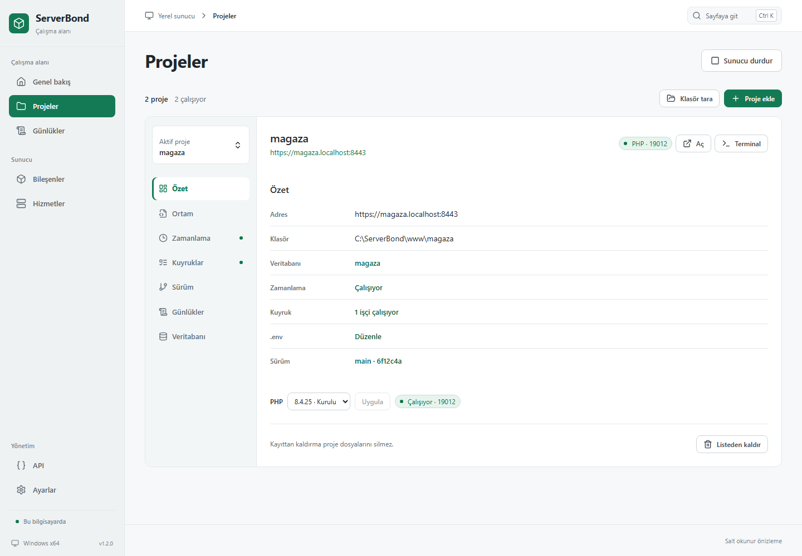

# ServerBond

Windows üzerinde Laravel projelerini, PHP sürümlerini ve yerel sunucu hizmetlerini tek panelden yönetin.

**[Windows için indir](https://github.com/beyazitkolemen/serverbond-windows/releases/latest)** · [Ekran görüntüleri](docs/screenshots/README.md) · [API rehberi](docs/api.md) · [MCP bağlantısı](docs/mcp.md)


## Kurulum

1. [Son sürümden](https://github.com/beyazitkolemen/serverbond-windows/releases/latest) `ServerBond_*_x64-setup.exe` dosyasını indirip kurun.
2. Uygulamayı açıp gerekli PHP, MySQL ve web sunucusu bileşenlerini kurun.
3. **Proje ekle** ile Laravel klasörünüzü seçin, GitHub deposu klonlayın veya yeni proje oluşturun.
4. **Sunucu başlat** düğmesine basın; proje detayındaki **Aç** ile uygulamanıza ulaşın.

Yeni kurulumların varsayılan konumu `C:\ServerBond`, proje çalışma alanı `C:\ServerBond\www` olur. Mevcut kurulumlar ve özel klasör tercihleri korunur.

Windows x64 ve internet bağlantısı gerekir. Kurulum WebView2 gereksinimini yönetir; PHP/MySQL için Microsoft Visual C++ Runtime gerekir. Windows 10 ve Server 2019/2022 geriye uyumluluk hedefleridir; bu sistemlerde uçtan uca doğrulama henüz tamamlanmadı. [Uyumluluk ayrıntıları](docs/windows-compatibility.md).

Son yayımlanan sürüm **v1.3.15**'tir. Bu sürüm elle kurulur ve imzalı otomatik güncelleme paketi içermez. Ekran görüntüleri v1.3.0 arayüzünün örnek verili, salt okunur önizlemesidir. [Sürüm notları](docs/releases/v1.3.15.md) · [Güncellemeler](docs/updates.md).

## Neler yapabilirsiniz?

- **Proje yönetimi:** proje başına PHP sürümü, `.env` düzenleyici, terminal ve günlükler.
- **Sunucu yönetimi:** PHP, MySQL ve Caddy; yerel HTTPS ve SQL yedekleme/geri yükleme.
- **Laravel işlemleri:** kuyruk işçileri, zamanlayıcı ve Git/Composer/Artisan adımlarından oluşan sürüm tarifi.
- **Ek hizmetler:** phpMyAdmin, Mailpit, PostgreSQL, Redis, GitHub ve Cloudflare tüneli.
- **GitHub:** tarayıcıdan giriş, hesabınızdan depo seçimi ve dal listeleri. [Bağlantı ayarı](docs/github.md).
- **API ve MCP:** proje, hizmet ve masaüstü işlemleri için yerel HTTP API, OpenAPI rehberi ve yapay zekâ istemcilerine MCP bağlantısı.
- **Cloud:** tek kullanımlık kodla cihaz eşleştirme ve Reverb üzerinden uzaktan hizmet/proje yönetimi.
- **Masaüstü:** açık/koyu tema, sistem tepsisi ve Windows başlangıç tercihleri.



[Tüm ekran görüntülerini inceleyin →](docs/screenshots/README.md)

## API

Sol menüdeki **API ve MCP** sayfasından erişimi açın ve jeton oluşturun. Varsayılan API adresi `http://127.0.0.1:18800/api/v1`; istekler `Authorization: Bearer <jeton>` başlığını kullanır. **MCP erişimini aç** ile aynı jetonu kullanan `http://127.0.0.1:18800/mcp` bağlantısı etkinleşir. API ve MCP varsayılan olarak kapalıdır.

[Uç noktalar, istek gövdeleri ve örnekler →](docs/api.md)

## Geliştirme

Windows masaüstü geliştirmesi için Node.js 22.12+ veya 24, Rust stable MSVC, Microsoft C++ Build Tools ve WebView2 gerekir.

```powershell
npm ci
npm run desktop
```

| Komut                            | İşlev                               |
| -------------------------------- | ----------------------------------- |
| `npm run dev`                    | Salt okunur tarayıcı önizlemesi     |
| `npm run check`                  | Arayüz derlemesi, rustfmt ve Clippy |
| `npm run test:core`              | Rust çekirdek testleri              |
| `npm run test:rust:parallel`     | Nextest ile sekiz eşzamanlı Rust testi |
| `npm run desktop:build:unsigned` | Windows EXE ve kurulum paketi       |

Paralel Rust komutu için [Nextest 0.9.146](https://nexte.st/docs/installation/pre-built-binaries/) gerekir. CI bu sürümü kendisi kurar; gerçek servis ve paket testleri ayrı koşulur.

[Mimari](docs/architecture.md) · [Test ortamı](docs/ai-environment.md) · [Paketler](docs/packages.md) · [Tasarım sistemi](docs/design/design-system.md)
