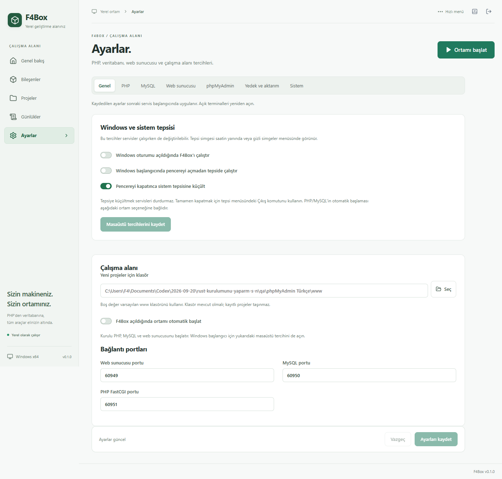

# F4Box Laravel

Windows x64 üzerinde PHP, MySQL, Caddy ve Composer indirip kuran; Laravel projelerini ve yerel servisleri yöneten Rust + Tauri masaüstü uygulaması.

PHP sürümü seçimi, projeye özel çalışma ortamları, phpMyAdmin, sistem tepsisi menüsü ve Windows başlangıç tercihleri aynı panelden yönetilir.

## İndir — v1.1

Uygulama sürümü **1.1.0**. Windows x64 paketleri CI tarafından `F4Box_1.1.0_x64-setup.exe`, `F4Box_1.1.0_x64.exe` ve `SHA256SUMS.txt` olarak üretilir.

- [Windows x64 kurulum EXE'si](https://github.com/beyazitkolemen/f4box-laravel/releases/download/v1.1/F4Box_1.1.0_x64-setup.exe): F4Box'ı kurar ve WebView2 gereksinimini yönetir.
- [Doğrudan çalıştırılabilir EXE](https://github.com/beyazitkolemen/f4box-laravel/releases/download/v1.1/F4Box_1.1.0_x64.exe): WebView2 kurulu bir Windows x64 bilgisayarda açılabilir; verileri `%LOCALAPPDATA%\F4Box` altında saklar.
- [v1.1 sürüm notları](docs/releases/v1.1.md)

v1.1 ikili paketi henüz yayımlanmadıysa son yayımlanan [v1.0](https://github.com/beyazitkolemen/f4box-laravel/releases/tag/v1.0) kullanılabilir.

Kaynak kodunu indirmeniz veya derlemeniz gerekmez. PHP/MySQL/Caddy gibi bileşenler ilk kullanımda ayrıca indirilir. Depo özel olduğu sürece indirme bağlantıları için depoya erişimi olan bir GitHub hesabıyla oturum açılmalıdır.


## Ekran görüntüleri

Görüntüler Windows üzerinde çalışan masaüstü uygulamasından alınmıştır. Yapay veriler veya tasarım maketleri değildir.

| Bileşen yönetimi | Windows ve sistem tepsisi |
| --- | --- |
|  |  |

[PHP ayarları ve tam boy görüntüler →](docs/screenshots/README.md)

## Kullanım

Derlenmiş `F4Box` uygulamasını açın. **Bileşenleri kur** ile gerekli paketleri hazırlayın; **Ortamı başlat** ile MySQL, PHP FastCGI ve Caddy'yi çalıştırın. **Proje ekle** ekranında mevcut Laravel kök klasörünü seçin veya **Yeni Laravel projesi** sekmesinden Laravel 12 oluşturun.

Projeler `http://proje-adi.localhost:8088` biçimindeki adreslerden açılır. `.localhost` alan adı kullanıldığı için hosts dosyası düzenlenmez. İlk açılışta 8088/13306/19000 portları doluysa bir sonraki boş portlar seçilip kaydedilir. Daha sonra kaydedilmiş bir port başka uygulama tarafından kullanılırsa F4Box o süreci durdurmaz; Ayarlar'dan boş bir port seçin. Geçerli adres proje satırında görünür.

| Bileşen | Sabit sürüm | İşlev |
| --- | --- | --- |
| PHP x64 NTS | 7.4.33 / 8.0.30 / 8.1.34 / 8.2.33 / 8.3.33 / 8.4.25 / 8.5.10 | Seçilebilir PHP CLI ve FastCGI |
| MySQL Community | 8.4.10 LTS | Yerel veritabanı |
| Caddy | 2.11.4 | Proje yönlendirme ve dosya sunma |
| Composer | 2.10.3 | Laravel proje kurulumu |
| phpMyAdmin | 5.2.3, tüm diller | Tarayıcıdan MySQL yönetimi |

Paketler uygulama kurulum paketine gömülmez; ilk kullanımda resmî kaynaklarından indirilir. Windows x64 Visual C++ 2015–2022 Redistributable ve WebView2 Runtime gerekir. Bu bilgisayarda ikisi de mevcuttur. Başka bir bilgisayarda PHP/MySQL başlatılamıyorsa önce [Microsoft Visual C++ Runtime](https://learn.microsoft.com/en-us/cpp/windows/latest-supported-vc-redist) kurulmalıdır. Tauri kurulum paketi WebView2 gereksinimini yönetir.

### PHP sürümü seçimi

Genel bakış veya Bileşenler ekranındaki **PHP sürümü** listesinden sürümü seçip **İndir ve kullan** düğmesine basın. Yalnızca seçilen Windows x64 NTS paketi indirilir ve resmî SHA-256 özetiyle doğrulanır. Kurulu sürüm için **Bu sürümü kullan** düğmesi görünür; tekrar indirilmez. Varsayılan sürüm 8.4.25'tir.

7.4 ve 8.0–8.5 serilerinin katalogdaki sabit yama sürümleri sunulur. Sürüm listesi `crates/f4box-core/php-versions.json` dosyasından gelir; çevrimiçi en son sürüme kendiliğinden güncellenmez. 7.4/8.0/8.1, eski projelerle uyumluluk için bulunur ve resmî güvenlik desteği sona ermiştir.

**Varsayılan PHP sürümü** yeni projeler ve genel CLI için kullanılır. Her proje kartındaki PHP listesinden ayrı sürüm seçilebilir; örneğin bir proje PHP 7.4, diğeri PHP 8.4 ile aynı anda çalışabilir. Eksik paket **İndir ve uygula** ile indirilir. Her proje ayrı bir PHP FastCGI süreci ve otomatik seçilen yerel port kullanır. Seçim uygulama yeniden açıldığında korunur. Önceki yapılandırmalar açılışta mevcut varsayılan sürüme sabitlenir; proje dosyaları değiştirilmez.

Projenin sürümü değiştirilmeden önce paket ve uzantılar doğrulanır. Yalnızca ilgili PHP süreci değiştirilir; Caddy yönlendirmesi kısa bir yeniden başlatmayla güncellenir. Diğer projelerin PHP süreçleri ve MySQL korunur. Yeni süreç başlatılamazsa eski proje seçimi ve süreç geri yüklenir. Varsayılan PHP değişikliği mevcut projelerin sürümlerini değiştirmez.

### Proje terminali ve gereksinimler

Proje kartındaki **Terminal**, o proje klasöründe Windows PowerShell açar. `php`, `composer` ve Composer'ın `@php` alt komutları projenin seçili PHP sürümünü kullanır. Örneğin `php artisan migrate` doğrudan çalıştırılabilir. Yalnızca açılan terminalin ortamı ayarlanır; sistem PATH'i değişmez. Proje sürümü değiştikten sonra açık terminali kapatıp yeniden açın. PHP ve Composer paketlerinin kurulu olması gerekir; terminal açılması servisleri başlatmaz.

**Ayarlar → Kurulum gereksinimleri**, Windows x64, Visual C++ x64 çalışma zamanı, Windows PowerShell, veri klasörüne yazma, disk alanı ve portları denetler. F4Box'a ait açık portlar kullanılabilir kabul edilir; başka uygulamanın portu hata olarak gösterilir. Visual C++ eksikse Microsoft indirme bağlantısı sunulur. Paket indirmeden önce platform, çalışma zamanı ve yazma erişimi denetlenir; düşük disk alanı uyarı olarak gösterilir. WebView2 kurulumu Tauri kurulum paketi tarafından yönetilir.

Her sürüm `bin/php/<sürüm>/` altında, üretilen PHP ayarları `config/php/<sürüm>/php.ini` altında tutulur. Uzantı dizini kullanılan PHP paketine aittir; eski kurulumların ortak `config/php.ini` dosyası artık kullanılmaz. F4Box bu ayar dosyalarını başlangıçta yeniden üretir. Windows genel PATH ayarı değiştirilmez.

PHP CLI ve FastCGI uzantıları sürüm geçişinden önce ayrı ayrı doğrulanır. Türkçe karakterli veri yolları için F4Box uzantı yolunu süreç argümanı ve `F4BOX_PHP_EXT` ortam değişkeniyle geçirir; Composer alt süreçleri aynı ayarı devralır. Üretilen `php.ini` başka bir terminalde kullanılacaksa bu ortam değişkeni de seçilen sürümün `ext` klasörünü göstermelidir.

**Yeni Laravel projesi** Laravel 12 oluşturduğu için PHP 8.2 veya üzeri gerektirir. Daha eski PHP seçiliyken işlem dosya oluşturmadan açıklama gösterir; mevcut projeler eklenebilir.

### MySQL

**phpMyAdmin:** Bileşenler ekranından phpMyAdmin'i indirin veya **Bileşenleri kur** ile tümünü kurun. PHP, MySQL ve Caddy çalışırken phpMyAdmin satırındaki **Aç** düğmesini kullanın. Adres `http://phpmyadmin.f4box.localhost:<web-portu>/` biçimindedir. Ayrı bir phpMyAdmin servisi gerekmez; varsayılan PHP sürümü kullanılır. Mevcut projelerin PHP seçimleri değişmez.

Kullanıcı `root`; parola **Ayarlar → Sistem → MySQL bağlantısı → Parolayı göster** bölümündedir. MySQL portu her web sunucusu başlangıcında F4Box ayarlarından alınır. Giriş cookie kimlik doğrulaması kullanır; MySQL parolası phpMyAdmin yapılandırmasına yazılmaz. Oturum ve geçici dosyalar `data/phpmyadmin/` altında, web kökünün dışında saklanır. Yalnızca yerel bilgisayardan erişilir; yapılandırma ve kurulum dizinleri HTTP üzerinden açılmaz. `config.inc.php` F4Box tarafından üretilir. Onarım MySQL verilerini değiştirmez.

phpMyAdmin'in isteğe bağlı yapılandırma depolaması tabloları otomatik oluşturulmaz. Bu nedenle gelişmiş özelliklerle ilgili bir bildirim görülebilir; veritabanlarını görüntüleme ve SQL çalıştırma kullanılabilir.

- İlk başlangıçta veri dizini hazırlanır ve rastgele root parolası atanır.
- Parola Ayarlar → Sistem → MySQL bağlantısı → **Parolayı göster** üzerinden görülür; diskte kullanıcıya bağlı Windows DPAPI ile şifrelenir.
- Varsayılan bağlantı `127.0.0.1:13306`, kullanıcı `root`.
- Proje satırındaki veritabanı düğmesi proje adıyla veritabanı oluşturur; tireler alt çizgiye dönüşür.
- Yedek düğmesi `mysqldump` ile SQL yedeği alır. Yedekler `backups/` altında saklanır.
- Mevcut Laravel `.env` dosyaları otomatik değiştirilmez. Bağlantı bilgilerini projenizin `.env` dosyasına girin. Yeni Laravel kurulumu kendi SQLite varsayılanıyla gelir.

```dotenv
DB_CONNECTION=mysql
DB_HOST=127.0.0.1
DB_PORT=13306
DB_DATABASE=proje_adi
DB_USERNAME=root
# Ayarlar ekranındaki parolayı buraya yazın; kaynak kontrolüne eklemeyin.
```

### Dosyalar

Varsayılan veri dizini `%LOCALAPPDATA%\F4Box`; geliştirme/test için `F4BOX_HOME` ile değiştirilebilir.

```text
F4Box/
  bin/       # sürüme göre ayrılmış programlar
  cache/     # SHA-256 doğrulanan indirme önbelleği
  config/    # PHP, Caddy, MySQL ayarları ve şifreli parola
  data/      # kalıcı MySQL verileri
  backups/   # SQL yedekleri
  logs/      # servis ve kurulum kayıtları
  www/       # yeni Laravel projeleri için varsayılan konum
  config.json
```

Uygulama kapanırken servisler durur. Windows Job Objects beklenmeyen kapanışta alt süreçlerin açık kalmasını önler. MySQL normal kapanışta `mysqladmin shutdown` kullanır. Aynı veri klasörünü ikinci bir F4Box süreci açamaz. Projeyi listeden kaldırmak proje klasörünü veya veritabanını silmez.

### Sorun giderme ve onarım

- **Kurulum eksik:** Yardımcı dosyalar ve kurulum kaydı kontrol edilir. Ortamı durdurup Bileşenler ekranındaki **Onar** düğmesine basın. Bozuk, etkin olmayan PHP sürümü listeden seçilince **Onar ve kullan** görünür.
- Onarım SHA-256 doğrulanmış önbellekten veya resmî indirmeden yapılır. Yeni paket tamamen açılmadan mevcut klasör değiştirilmez. Önceki program klasörü `bin/<bileşen>/<sürüm>-before-repair-<kimlik>` adıyla korunur; `data`, `www`, `backups` ve proje `.env` dosyalarına dokunulmaz.
- **Beklenmedik servis kapanışı:** Bileşenler ekranındaki uyarıyı ve ilgili günlüğü inceleyin; **Başlat** başarılı olduğunda uyarı temizlenir.
- Portlar kaydedilirken kullanımda olup olmadıkları kontrol edilir. Port sonradan başka program tarafından alınırsa servis başlangıcında tekrar kontrol edilir.
- PHP resmî sürüm adresi 404/410 döndürürse aynı sabit paket resmî arşivde aranır; SHA-256 kontrolü değişmez. İndirmede bağlantı için 30 saniye, tüm aktarım için 30 dakika bekleme sınırı vardır.
- PHP doğrulaması 20 saniye, MySQL sorguları 30 saniye ile sınırlıdır. Zaman aşımında sahip olunan alt süreçler kapatılır. Yedek dosyaları benzersiz ad taşır; peş peşe yedekler birbirinin üzerine yazılmaz.

## Geliştirme

Gereksinimler: Windows x64, Node.js 22.12+ veya 24, Rust stable MSVC, Microsoft C++ Build Tools (Desktop development with C++) ve WebView2. `rust-toolchain.toml` `stable` kullanır; Windows masaüstü derlemesi için rustup varsayılanı `x86_64-pc-windows-msvc` olmalıdır. Cloud Agent kurulumu ve hızlı testler: [docs/ai-environment.md](docs/ai-environment.md).

```powershell
npm ci
npm run desktop
```

`npm run dev` yalnızca salt okunur tarayıcı önizlemesini `http://127.0.0.1:1420` adresinde açar. Kurulum ve servis işlemleri için `npm run desktop` kullanın. Önizleme sahte kurulum sonucu üretmez.

### Derleme

```powershell
npm run desktop:build
```

Çalıştırılabilir dosya `target/release/f4box-desktop.exe`; NSIS kurulum paketi `target/release/bundle/nsis/` altında üretilir. Windows CI aynı adımlarla `artifacts/F4Box_<sürüm>_x64.exe`, `F4Box_<sürüm>_x64-setup.exe` ve `SHA256SUMS.txt` yükler.

### Doğrulama

```powershell
npm run test:ai
```

Linux Cloud Agent ve çekirdek denetimleri `npm run test:ai` ile çalışır. Tam workspace clippy ve Tauri derlemesi Windows’ta:

```powershell
npm run build
cargo test -p f4box-core
cargo fmt --all -- --check
cargo clippy --workspace --all-targets -- -D warnings
```

Gerçek paketleri indirip MySQL/PHP/Caddy ile bütünleşme testi:

```powershell
# Masaüstü uygulaması kapalı olmalı. Ayrı veri klasörü istenirse F4BOX_HOME ayarlayın.
npm run test:integration
```

Bu test boş portlar seçer; geçici projeyle PHP FastCGI yönlendirmesini, PDO MySQL uzantısını, MySQL yazma/okumayı, SQL yedeğini, gizli dosya engelini ve servislerin yeniden başlamasını doğrular. Teste ait veritabanı/proje temizlenir ve önceki port ayarları geri yüklenir. Kurulan paketler ve MySQL veri dizini korunur.

CLI de aynı çekirdeği kullanır:

```powershell
cargo run -p f4box-core --bin f4box -- status
cargo run -p f4box-core --bin f4box -- install all
cargo run -p f4box-core --bin f4box -- php
cargo run -p f4box-core --bin f4box -- php 7.4.33
cargo run -p f4box-core --bin f4box -- serve
cargo run -p f4box-core --bin f4box -- add benim-projem C:\Projeler\benim-projem
```

Tüm PHP paketlerini indirerek FastCGI, uzantılar, Composer, çalışan ortamda sürüm geçişi, başarısız geçişten geri dönüş ve seçim kalıcılığı testi (ayrı geçici veri dizini kullanır):

```powershell
cargo test -p f4box-core --test php_matrix -- --ignored --nocapture
cargo test -p f4box-core --test environment -- --ignored --nocapture
```

`environment` testi ayrı ve geçici MySQL veri dizininde ilk kurulumu, Türkçe SQL verisini, yedekleri ve MySQL program onarımından sonra verinin korunmasını sınar. İsteğe bağlı `F4BOX_TEST_CACHE` mevcut bir indirme önbelleğini gösterir; dosyalar test klasörüne kopyalanıp yeniden doğrulanır, mevcut veritabanı kullanılmaz.

PHP matrisi testi ayrıca iki projenin eşzamanlı farklı sürüm kullanmasını, diğer projenin süreç kimliğinin korunmasını, proje terminalindeki PHP ve Composer alt süreçlerini, Türkçe/kesme işaretli yolları ve proje sürümü geçişinin geri alınmasını sınar. Proje PHP günlükleri proje kartından açılabilir. Bozuk bir proje PHP paketi, ortam durdurulduktan sonra **Onar ve uygula** ile varsayılan sürüm değiştirilmeden onarılabilir.

## İlk sürümün sınırları

- Windows x64, proje başına seçilebilir PHP 7.4–8.5 ve katalogdaki MySQL sürümü desteklenir. Node.js, Redis, otomatik HTTPS ve kuyruk yönetimi bu sürümde yoktur.
- Ortam yerel geliştirme içindir; ağdan erişime açılmaz. Her proje tek bir PHP FastCGI süreci kullanır.
- Yeni Laravel oluşturma PHP bağımlılıklarını kurar; frontend bağımlılıkları/Vite derlemesi ayrıca proje içinde yapılır.
- MySQL sürüm yükseltmesi, otomatik veri taşıma ve yedekten geri yükleme henüz yoktur. Veri klasörünü başka MySQL sürümüyle açmayın.
- DPAPI parolası Windows kullanıcısına bağlıdır; veri dizininin başka bilgisayara kopyalanması tek başına taşınabilir kurulum sağlamaz. Taşıma için SQL yedeği kullanın.
- Kurulum paketi kod imzalı değildir. Mevcut Herd/Laragon/Docker kurulumları ve proje `.env` dosyaları değiştirilmez.

## Hata yönetimi ve kurtarma

- Masaüstü komutlarında yakalanabilen Rust panikleri uygulama durumunu kilitlemez. Yeni işlemler engellenir; durum, günlükler ve servisleri durdurma kullanılabilir kalır. Ekrandaki yönlendirmeyle ortamı durdurup uygulamayı yeniden açın.
- Bozuk `config.json` veya mevcut veri/yedek varken kaybolan yapılandırma, masaüstünde kurtarma ekranını açar. **Son geçerli yedeği geri yükle**, `config.last-good.json` içindeki önceki ayarları ve proje listesini geri getirir. Bozuk dosya `config.corrupt-<kimlik>.json` olarak saklanır. Geçerli yedek yoksa uygulama dosyayı sıfırlamaz. Bu işlem SQL/veritabanı yedeğini geri yüklemez.
- Ayarlar, üretilen PHP/MySQL/Caddy dosyaları ve şifrelenmiş parolalar geçici dosyaya yazılıp diske aktarılır, ardından hedef dosya değiştirilir. İzin, disk veya dosya kilidi hatasında eski dosya korunur. Yapılandırmanın önceki geçerli sürümü ayrı tutulur.
- Daha önce hazırlanmış MySQL'in veri klasörü kayıpsa boş veritabanı oluşturulmaz. Mevcut veri ile parola dosyası tutarsızsa başlatma durur. Sistem denetimi bu sorunları ve açık süreçlerin yanıt vermeyen portlarını gösterir.
- Yapılandırma 2 MB, kurulum kaydı 256 KB, şifrelenmiş anahtar 64 KB ile sınırlıdır. Arşivlerde dosya sayısı, toplam açılmış boyut, gerçek dosya uzunluğu ve boş disk alanı denetlenir. Yakalanan komut çıktısı işlem sürerken izlenir; 8 MB sınırı veya süre sınırı aşılırsa ilgili alt süreç kapatılır.
- Günlük görüntüleme son 64 KB ile sınırlıdır. F4Box'ın kendi günlüğü 4 MB üzerinde döndürülür; bir önceki dosya saklanır. PHP/MySQL/Caddy'nin sürekli yazdığı servis günlükleri bu döndürme kapsamına girmez.
- Beklenmedik servis kapanmaları görünür hata oluşturur; otomatik yeniden başlatma döngüsü yoktur. Başlangıç başarısızlığında yalnızca o işlemde başlatılan süreçler geri alınır. Kapatmada sahip olunan tüm servislere durdurma uygulanır.
- Arayüz çizim hatalarında yeniden yükleme ekranı gösterilir. Durum okuması yanıt vermediğinde işlemler devre dışı kalır; aynı bekleyen okuma tekrar gönderilmez. Uzun süren yazma/kurulum işlemleri arayüz zaman aşımıyla yeniden başlatılmaz.

Elektrik kesintisi, işletim sisteminin süreci zorla kapatması veya bellek tükenmesi için kesintisiz çalışma garantisi yoktur. Yapılandırma yedeği veritabanı yedeğinin yerini tutmaz; önemli veriler için SQL yedeği alın. Otomatik testler arasında bozuk/kayıp yapılandırma, geçersiz yedek, kilitli dosya, kayıp MySQL verisi/parolası, iç panik ve aşırı komut çıktısı senaryoları bulunur.

## Mimari

- `crates/f4box-core`: katalog, güvenli indirme/arşiv açma, süreç yönetimi, MySQL, projeler, CLI.
- `src-tauri`: dar kapsamlı masaüstü IPC komutları ve klasör seçimi.
- `src`: React/TypeScript arayüzü.
- `docs/design`: konsept ve tasarım sistemi.
- `docs/packages.md`: paket kökeni ve SHA-256 güncelleme süreci.

## Kullanıcı tarafından yönetilen ayarlar

Ayarlar ekranı Genel, PHP, MySQL, Web sunucusu, phpMyAdmin, Yedek ve aktarım, Sistem bölümlerine ayrılır. Ortamı durdurun, tercihleri düzenleyin, **Ayarları kaydet** ile doğrulatın ve ortamı yeniden başlatın. PHP ayarları ortak veya sürüme özel kaydedilebilir; uzantılar ve ek ini seçenekleri gerçek kurulu PHP ile denetlenir. Açık proje terminallerini yeniden açın.

Yeni proje ve SQL yedek klasörleri seçilebilir. Adres kalıbı değişikliği tüm kayıtlı proje adreslerine uygulanır; `.env` dosyaları korunur. JSON içe aktarma, önceki ayarları getirme ve varsayılanlara dönme önce taslak oluşturur. Tercihlerin önceki sürümü `config/settings.previous.json` içinde saklanır. Onarımda kullanıcı tercihleri korunur.

Üretilen servis dosyalarını elle düzenlemek yerine bu ekranı kullanın. Desteklenen seçenekler, ayrıntılı Laragon karşılaştırması ve henüz uygulanmayan özellikler: [Laragon incelemesi](docs/laragon-incelemesi.md).

Gerçek PHP/MySQL/Caddy ayar testi:

```powershell
cargo test -p f4box-core --test preferences_runtime -- --ignored --nocapture
```

## Windows masaüstü ve sistem tepsisi

Saat yanındaki F4Box simgesine sol tıklamak pencereyi açar; sağ tıklamak hızlı menüyü açar. Simge Windows'un gizli simgeler bölümünde olabilir. Menüde tüm servisleri başlat/durdur/yeniden başlat, ayrı PHP/MySQL/web servisleri, phpMyAdmin, Ayarlar / Özellikler, günlükler, veri klasörü ve Çıkış bulunur. Menü durumu pencere gizliyken de güncellenir. Ana penceredeki **Hızlı menü** aynı Windows menüsünü açar.

**Ayarlar → Genel → Windows ve sistem tepsisi** altında üç tercih vardır:

- Windows oturumu açıldığında F4Box'ı çalıştır: yalnızca mevcut Windows kullanıcısının başlangıç kaydını yönetir. İlk kurulumda kapalıdır; yönetici yetkisi istemez.
- Windows başlangıcında tepside çalıştır: otomatik açılışta pencereyi gizler. Normal kısayolla açılış her zaman pencereyi gösterir; tepsi veya yapılandırma hatasında pencere gizlenmez.
- Pencereyi kapatınca tepsiye küçült: varsayılan olarak açıktır; X düğmesi servisleri çalışır bırakır. Bu seçenek kapalıysa X düğmesi servisleri durdurup çıkar. Menüdeki **Çıkış — servisleri durdur** ve penceredeki **F4Box'tan çık** her zaman tam çıkış içindir.

Bu tercihler servisler çalışırken de kaydedilebilir. PHP/MySQL/Caddy'nin F4Box açıldığında başlaması, ayrı **F4Box açıldığında ortamı otomatik başlat** seçeneğine bağlıdır. Tam otomatik ortam için hem Windows başlangıcını hem ortam başlangıcını açın. Kısayola ikinci kez tıklamak mevcut pencereyi öne getirir; ikinci bir servis grubu başlatmaz.

Masaüstü tercihleri `config/desktop.json` içinde, önceki dosya `config/desktop.previous.json` içinde tutulur. Windows başlangıç kaydı işletim sisteminden okunur; uygulama açılırken kullanıcı izni olmadan yeniden etkinleştirilmez. Bu cihaz tercihleri PHP/sunucu ayarlarının JSON aktarımına dahil değildir. Boşluklu/Türkçe yollar tırnaklanır; Windows başlangıç komutunun 260 karakter sınırı denetlenir. Programın konumunu değiştirdiğinizde başlangıç seçeneğini kapatıp yeniden açın; kaldırmadan önce otomatik başlangıcı kapatın.

Teknik kaynaklar: [Tauri sistem tepsisi](https://v2.tauri.app/learn/system-tray/), [tek uygulama örneği](https://v2.tauri.app/plugin/single-instance/), [Windows kullanıcı başlangıç kayıtları](https://learn.microsoft.com/en-us/windows/win32/setupapi/run-and-runonce-registry-keys).
