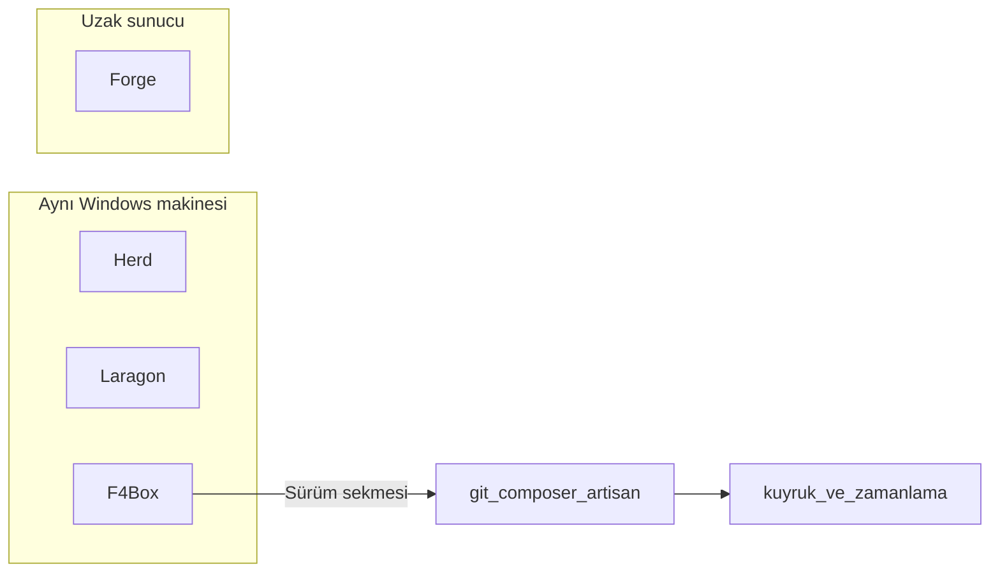

# Herd, Laragon, Forge ve F4Box

İnceleme tarihi: 20 Eylül 2026. Kapsam: Laravel Herd, Laragon ve Laravel Forge’un kamuya açık belgelerindeki roller ile F4Box’ın Windows üzerindeki konumu. Üç ürünün arayüzü bu incelemede tek tek tıklanarak doğrulanmamıştır; belgelerde yazılmayan davranış varsayılmamıştır. Laragon satırları için ayrıntı: [laragon-incelemesi.md](laragon-incelemesi.md).

F4Box bir yerel geliştirme kopyası (Herd / Laragon) değildir. Amaç, Windows x64 üzerinde Laravel uygulamasını **aynı makinede üretim gibi** çalıştırmaktır: sabit PHP/MySQL/Caddy, proje PHP’si, kuyruk, zamanlayıcı ve yapılandırılmış sürüm (git + Composer + Artisan). Laravel Forge’un uzak VPS, SSH ve push-to-deploy katmanı yoktur ve eklenmez.

## Ürün rolleri

| Ürün | Rol | F4Box karşılığı |
| --- | --- | --- |
| **Laravel Herd** | macOS/Windows yerel PHP/nginx, site isolate, Herd Pro’da dump / Xdebug / günlük, Expose ile paylaşım | PHP 7.4–8.5, proje PHP, Caddy, yerel HTTPS, Mailpit, Cloudflare tüneli, sekmeli proje detayı. Dump penceresi, Xdebug uzantısı ve Expose/ngrok yok. |
| **Laragon** | Taşınabilir WAMP; Quick-add (Redis/Postgres), Quick-app, Mailpit, Auto SSL, Procfile | Caddy + MySQL 8.4, Mailpit, yerel HTTPS, kuyruk/zamanlayıcı. Redis, Postgres, Apache/Nginx, serbest Procfile ve WordPress/Symfony tarifleri yok. |
| **Laravel Forge** | Uzak VPS: git push-to-deploy, deploy script, zero-downtime, Supervisor, Let’s Encrypt | **Yerel sürüm sekmesi**: git pull, Composer, `migrate --force`, `optimize:clear`, ek Artisan satırları, kayıtlı kuyruk işçileri ve zamanlayıcının yeniden başlatılması. Uzak SSH, sunucu provision, zero-downtime ve genel Let’s Encrypt yok. |

## Forge Deployments’ın yerel karşılığı

Forge’da sürüm uzak sunucuda çalışır: depo çekilir, isteğe bağlı script çalışır, kuyruk işçileri Supervisor üzerinden yenilenir. F4Box aynı sırayı **proje klasöründe** uygular; kabuk scripti yoktur.

| Forge (uzak) | F4Box (yerel, bu makine) |
| --- | --- |
| Git pull / seçilen dal | `git pull`; isteğe bağlı dal. `git` PATH’te yoksa Türkçe hata. |
| `composer install --no-dev` (üretim) | Katalogdaki Composer + projenin PHP’si; isteğe bağlı `--no-dev`. |
| `php artisan migrate --force` | Aynı sabit bayraklar. |
| Optimizasyon / cache | `php artisan optimize:clear --no-interaction --no-ansi` |
| Serbest deploy scripti | Yalnızca `a-z0-9:_-` Artisan komutu + `--bayrak` / `--bayrak=değer` |
| Supervisor restart | Kayıtlı ve etkin `queue:work` işçileri + `schedule:work` |
| 10 dk civarı tavan | Ortam meşgul kilidi, birleşik çıktı (`--- git ---`), 10 dakika |
| Deploy geçmişi | Son 20 kayıt: `logs/release-{proje}.jsonl` |

`.env` yazılmaz. Serbest PowerShell, uzak SSH ve “Forge-lite” sunucu yönetimi yoktur.

## Bilinçli olarak eklenmeyenler

Ürün kuralı ve önceki kapsam: Apache/Nginx seçimi, Redis, Horizon, uzak SSH, Expose/ngrok, dump penceresi, Xdebug uzantısı, serbest PowerShell scripti, zero-downtime symlink sürümü ve genel sertifika otoritesi.

Herd’in site isolate ve paylaşım katmanı Cloudflare tüneli ile kısmen karşılanır; genel adres eşlemesi Cloudflare panelindedir. Laragon Quick-add paketleri F4Box katalog doğrulamasıyla sınırlıdır.

## Doğrulama

Sürüm tarifinin enjeksiyon reddi, adım sırası, `git` yokken hata, `migrate --force --no-ansi` ve eski `config.json` yüklemesi çekirdek testlerindedir. Arayüz: proje detayı → **Sürüm**. CLI: `f4box project release <ad>`.
