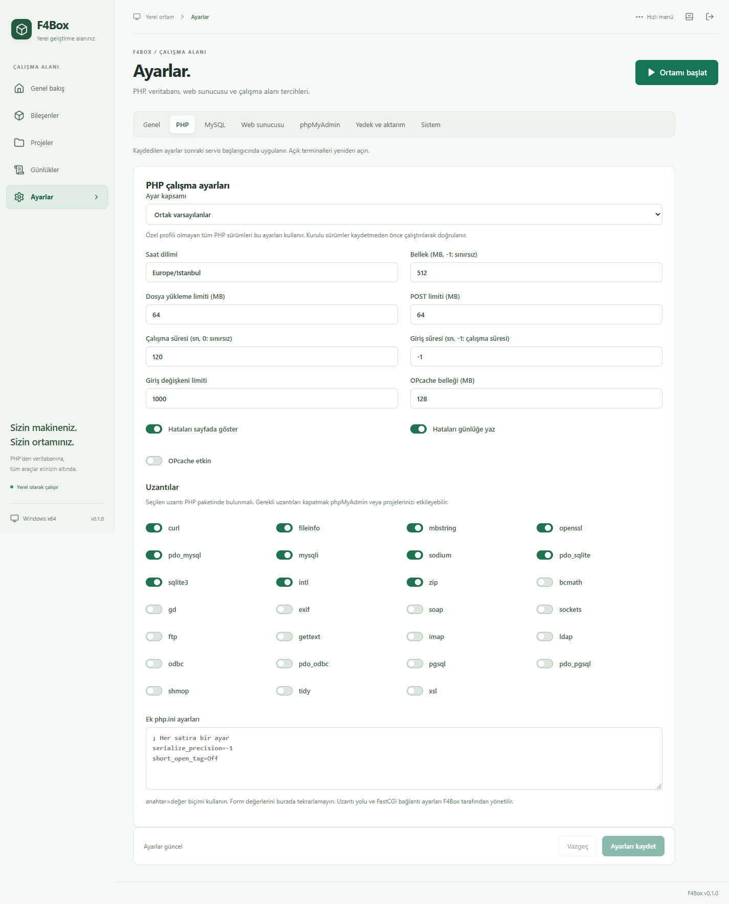

# Uygulama ekran görüntüleri

20 Eylül 2026 tarihinde F4Box 0.1.0'ın Windows x64 masaüstü sürümünden, WebView2 içeriği 1440 × 1040 boyutundayken tam sayfa olarak alındı. Windows pencere çerçevesi ve görev çubuğu görüntülere dahil değildir. Test için ayrı bir yerel veri klasörü kullanıldı; gösterilen portlar bu test ortamına aittir.

## Genel bakış

PHP, MySQL ve Caddy gerçekten çalışırken durum özeti, sürümler ve servis işlemleri.

## Bileşenler

Kurulu paketler, gerçek süreç kimlikleri, PHP sürümü seçimi ve onarım işlemleri.

## Windows ve sistem tepsisi

Servisler durdurulduktan sonra Windows başlangıç tercihleri, tepsi davranışı ve bağlantı portları. Otomatik Windows başlangıcı bu testte etkinleştirilmedi.

## PHP ayarları

PHP profilleri, bellek ve dosya yükleme sınırları, hata gösterimi ve uzantı seçimi.

