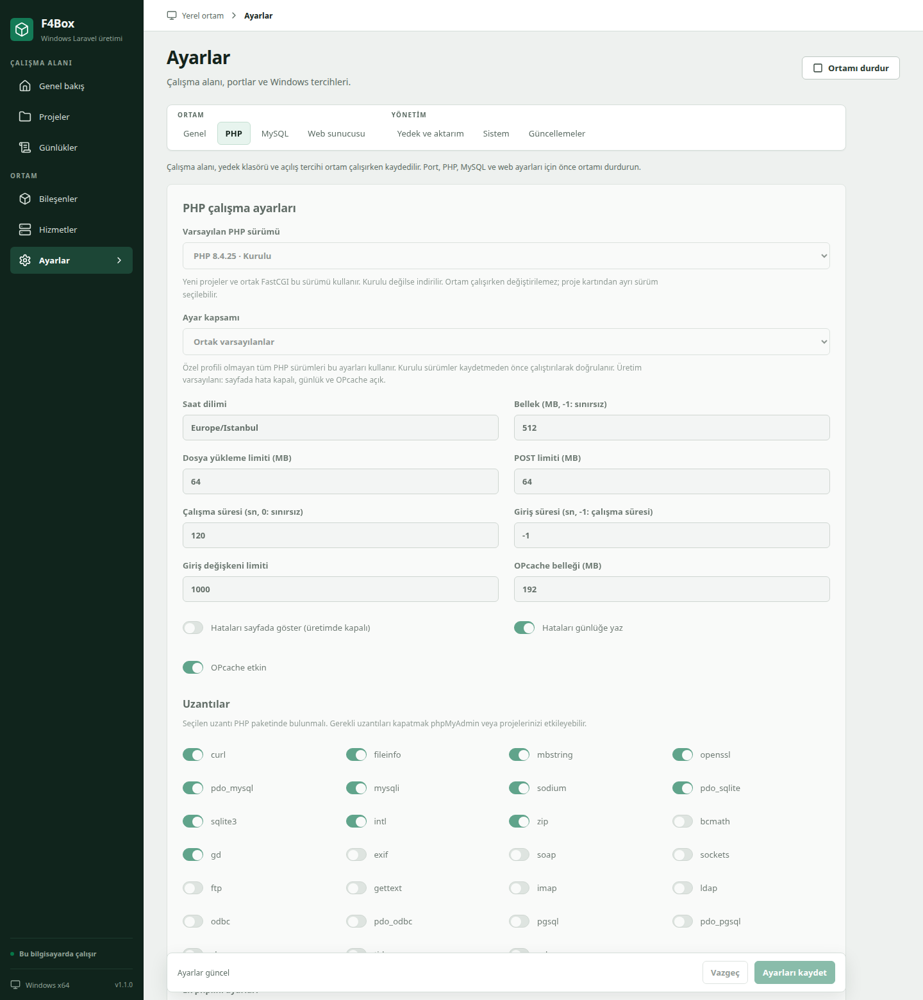

# Uygulama ekran görüntüleri

F4Box 1.1.0 arayüzünden 1440 piksel genişlikte tam sayfa olarak alındı. Windows pencere çerçevesi ve görev çubuğu görüntülere dahil değildir.

Görüntüler `npm run build && node scripts/ai/screenshots.mjs` komutuyla üretilir. Komut, üretim derlemesini başsız tarayıcıda açar ve salt okunur tarayıcı önizlemesine `scripts/ai/screenshot-data.json` örnek verisini yükler: gösterilen proje adları, portlar ve süreç kimlikleri bu örnek veriden gelir, gerçek bir kurulumdan ölçülmez.

## Genel bakış

Kontrol odası: ortam özeti, sade bileşen tablosu, kompakt proje satırları ve son kayıtlar.

## Bileşenler

Kurulu paketler, sürümler, lisanslar, süreç kimlikleri, varsayılan PHP sürümü seçimi ve onarım işlemleri.

## Projeler, kuyruk ve zamanlama

Proje listesi ve sekmeli detay: Özet, Zamanlama, Kuyruklar, Sürüm, Günlükler, Veritabanı. Kuyruk sekmesinde `queue:work` işçileri, gelişmiş sınırlar ve başarısız işler.

## Yerel sürüm

Forge benzeri üretim sürümü aynı Windows makinesinde: git pull, Composer, `migrate --force`, `optimize:clear`, ek Artisan satırları ve kuyruk/zamanlayıcı yeniden başlatma. Uzak sunucu yoktur; `.env` yazılmaz.

## Proje günlükleri

Proje detayındaki Günlükler sekmesi PHP FastCGI, Laravel zamanlayıcı ve kuyruk işçisi kayıtlarını arama, satır numarası ve hata vurgusuyla gösterir.

## Yerel e-posta yakalama

Mailpit'in SMTP ve arayüz portları, saklama sınırı, PHP `mail()` yönlendirmesi ve servis durumu.

## İsteğe bağlı PostgreSQL

MySQL varsayılan kalır. Kullanıcı isterse PostgreSQL 17 kurulur: port, otomatik başlatma, kur/başlat/onar ve parola. `.env` yazılmaz.

## Cloudflare tüneli

Cloudflared kurulumu, jeton kaydı, tünelin başlatılması ve ortamla birlikte otomatik başlatma tercihi.

## Sistem: Node.js ve Windows izinleri

İsteğe bağlı Node.js LTS kurulumu; güvenlik duvarı kuralları, veri klasörü yetkisi ve isteğe bağlı Microsoft Defender istisnası için tek seferlik izin.

## PHP ayarları

Ortam / Hizmetler / Yönetim gruplu sekmeler; PHP profilleri, bellek ve dosya yükleme sınırları, hata gösterimi ve uzantı seçimi.

## Web sunucusu ve yerel HTTPS

Proje adres kalıbı, FastCGI süreleri, sıkıştırma ve Laragon Auto SSL karşılığı yerel HTTPS: dahili CA, HTTPS portu, HTTP yönlendirme ve Windows kullanıcı güven deposu.

