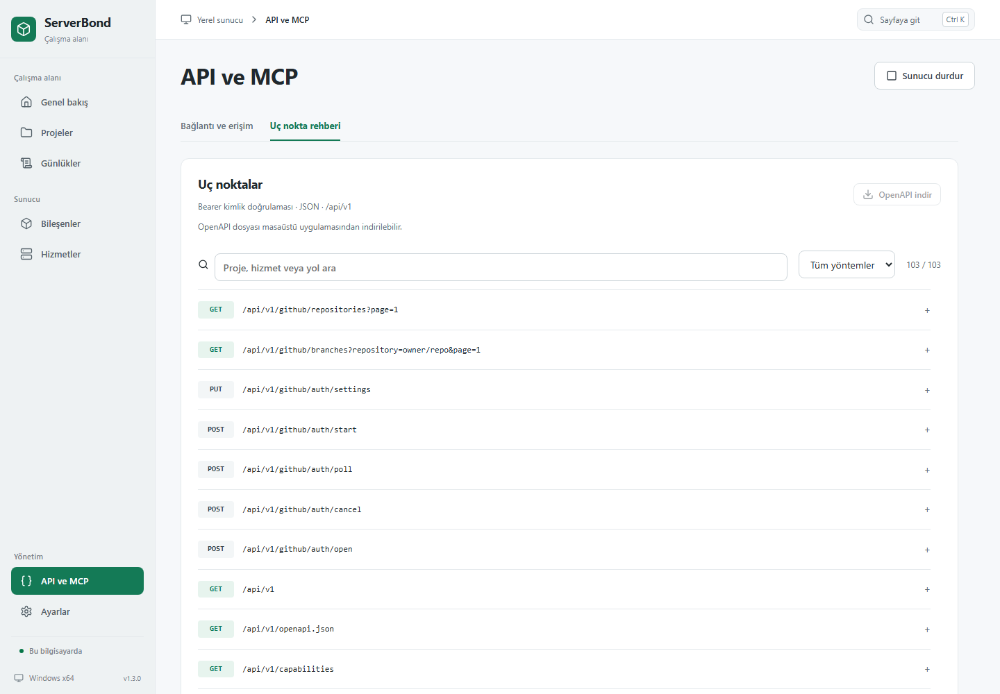
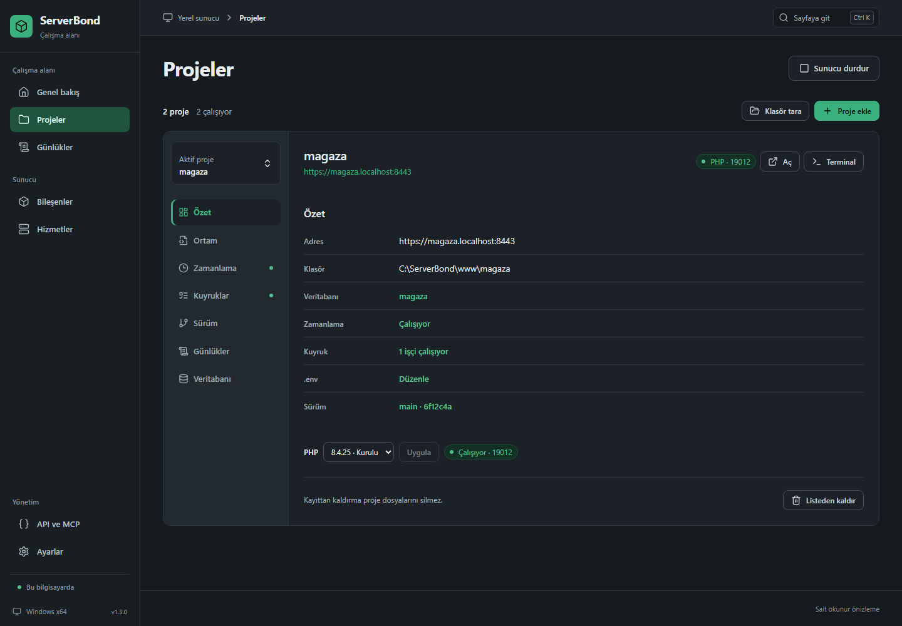

# Ekran görüntüleri

Güncel `main` arayüzü, 21 Eylül 2026. Görüntüler 1440 piksel genişlikte uygulamanın salt okunur tarayıcı önizlemesinden alınmıştır. Proje adları, portlar ve süreç bilgileri örnek veridir; Windows pencere çerçevesi dahil değildir. Yayımlanmış v1.2.0 paketi bu arayüz değişikliklerinin tamamını içermez.

Kaynak sürüm: [`a14159c`](https://github.com/beyazitkolemen/serverbond-windows/tree/a14159c). Görüntüler `C:\ServerBond` veri klasörünü ve `C:\ServerBond\www` varsayılan proje yolunu gösterir; farklı konumdaki mevcut projeler de korunur.

## Genel bakış

Sunucu durumu, bileşenler ve projeler.


## Proje detayı

Solda aramalı proje seçici ve bölüm menüsü; sağda proje bilgileri ve işlemler.


## Hizmetler

Her hizmet tek satırda; durum ve ayarlar ayrı bölümlerde.


## API

Bağlantı ve erişim yönetimi ile aranabilir uç nokta rehberi.



## Koyu tema



## Diğer ekranlar

<details>
<summary>Bileşenler</summary>


</details>

<details>
<summary>Kuyruk işçileri</summary>


</details>

<details>
<summary>Sürüm tarifi ve geçmişi</summary>


</details>

<details>
<summary>Ortam değişkenleri</summary>


</details>

<details>
<summary>Proje günlükleri</summary>


</details>

<details>
<summary>E-posta ayarları</summary>


</details>

<details>
<summary>Cloudflare tüneli ayarları</summary>


</details>

<details>
<summary>PostgreSQL</summary>


</details>

<details>
<summary>Redis</summary>


</details>

<details>
<summary>GitHub hesabı</summary>


</details>

<details>
<summary>GitHub’dan proje ekleme</summary>


</details>

<details>
<summary>Sistem ayarları</summary>


</details>

<details>
<summary>PHP ayarları</summary>


</details>

<details>
<summary>Web sunucusu ve HTTPS</summary>


</details>

## Görüntüleri yenileme

Chrome kurulu bir geliştirme ortamında:

```sh
npm run build
node scripts/ai/screenshots.mjs
```

Windows’ta Chrome yolu gerekirse PowerShell ile belirtilir:

```powershell
$env:CHROME = "C:\Program Files\Google\Chrome\Application\chrome.exe"
node scripts/ai/screenshots.mjs
```

Betik üretim derlemesini `scripts/ai/screenshot-data.json` örnek verisiyle açar. Menü adımlarından biri bulunamazsa işlemi hata ile durdurur; gerçek servisleri veya kullanıcı projelerini çalıştırmaz.
