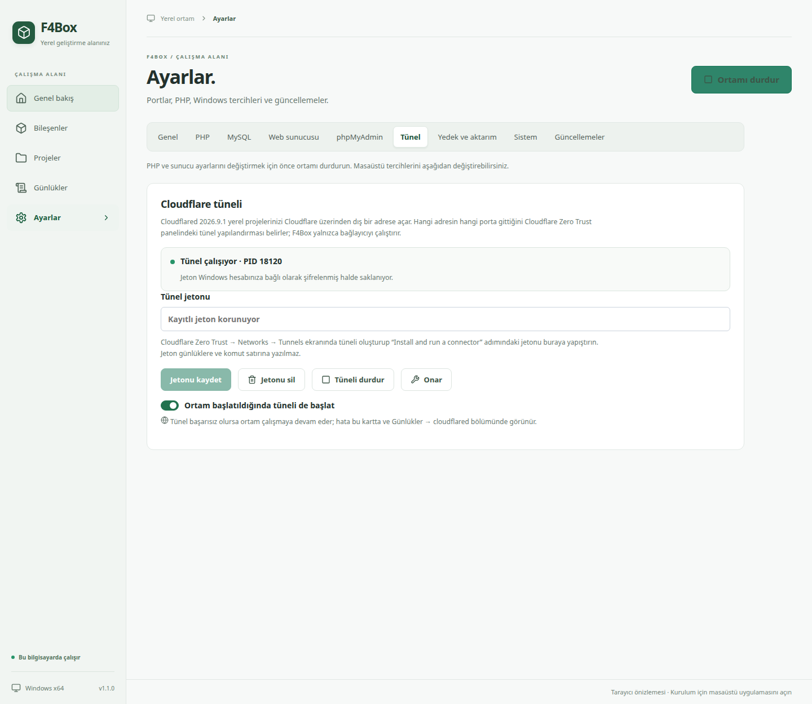
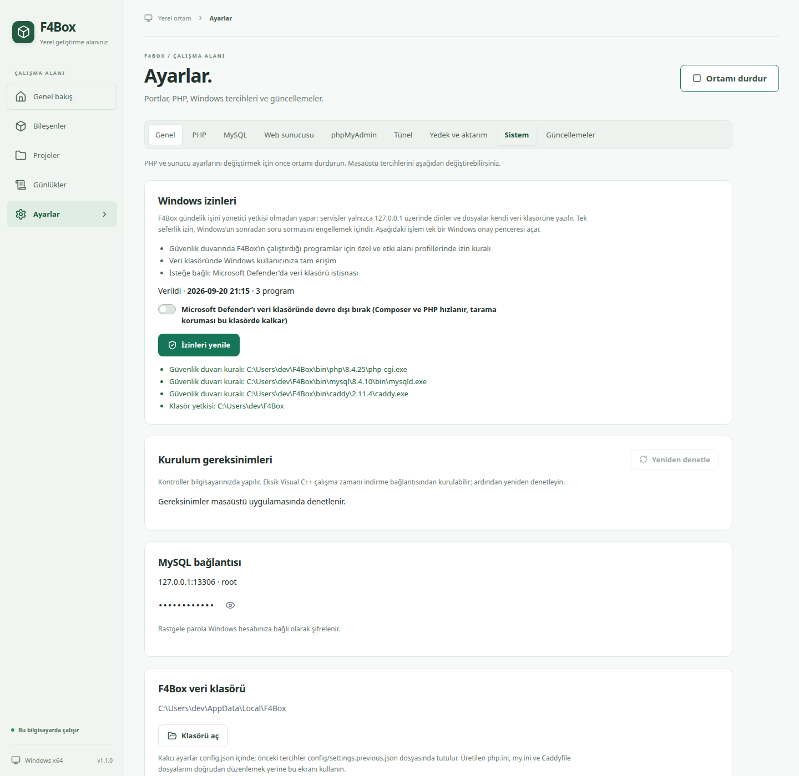
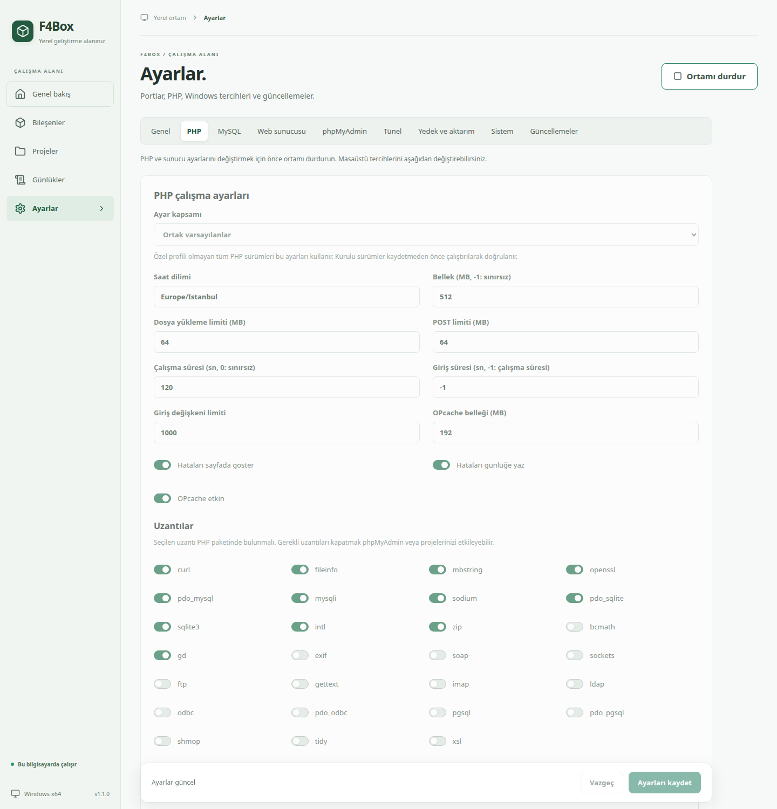

# Uygulama ekran görüntüleri

F4Box 1.1.0 arayüzünden 1440 piksel genişlikte tam sayfa olarak alındı. Windows pencere çerçevesi ve görev çubuğu görüntülere dahil değildir.

Görüntüler `npm run build && node scripts/ai/screenshots.mjs` komutuyla üretilir. Komut, üretim derlemesini başsız tarayıcıda açar ve salt okunur tarayıcı önizlemesine `scripts/ai/screenshot-data.json` örnek verisini yükler: gösterilen proje adları, portlar ve süreç kimlikleri bu örnek veriden gelir, gerçek bir kurulumdan ölçülmez.

## Genel bakış

Ortam durumu, bileşen tablosu, proje listesi ve son günlük satırları tek ekranda.

## Bileşenler

Kurulu paketler, sürümler, lisanslar, süreç kimlikleri, varsayılan PHP sürümü seçimi ve onarım işlemleri.

## Projeler, kuyruk ve zamanlama

Proje kartından PHP sürümü seçimi; kart içindeki panelden Laravel `schedule:run` zamanlayıcısı ve Supervisor benzeri `queue:work` işçileri.

## Cloudflare tüneli

Cloudflared kurulumu, jeton kaydı, tünelin başlatılması ve ortamla birlikte otomatik başlatma tercihi.

## Windows izinleri

Güvenlik duvarı kuralları, veri klasörü yetkisi ve isteğe bağlı Microsoft Defender istisnası için tek seferlik izin.

## PHP ayarları

PHP profilleri, bellek ve dosya yükleme sınırları, hata gösterimi ve uzantı seçimi.

